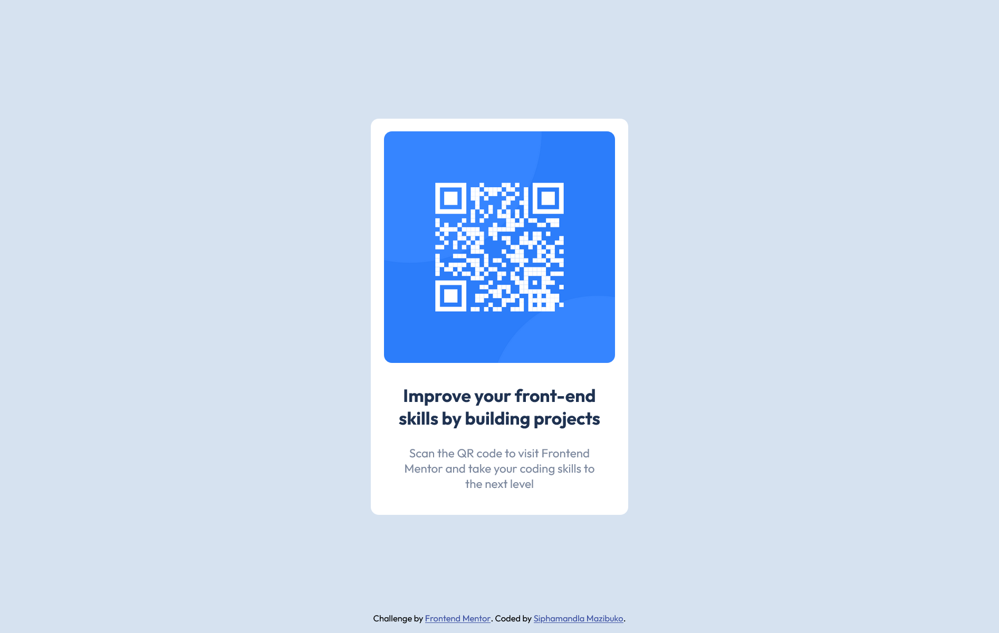

# QR code component solution using CSS Flex

This is a solution to the [QR code component challenge on Frontend Mentor](https://www.frontendmentor.io/challenges/qr-code-component-iux_sIO_H).

## Table of contents

- [Overview](#overview)
  - [Screenshots](#screenshots)
    - [Desktop](#desktop)
    - [Mobile](#mobile)
  - [Link](#link)
- [My process](#my-process)
  - [Built with](#built-with)
- [Author](#author)

## Overview

### Screenshots

#### Desktop

#### Mobile

### Link

- Live Site URL: [click me](https://qr-code-component-fawkes.netlify.app)

## My process

### Built with

- HTML5 markup
- CSS custom properties
- CSS Flexbox

## Author

- Frontend Mentor - [@fawkesdbs](https://www.frontendmentor.io/profile/fawkesdbs)
- GitHub - [fawkesdbs](https://github.com/fawkesdbs)
